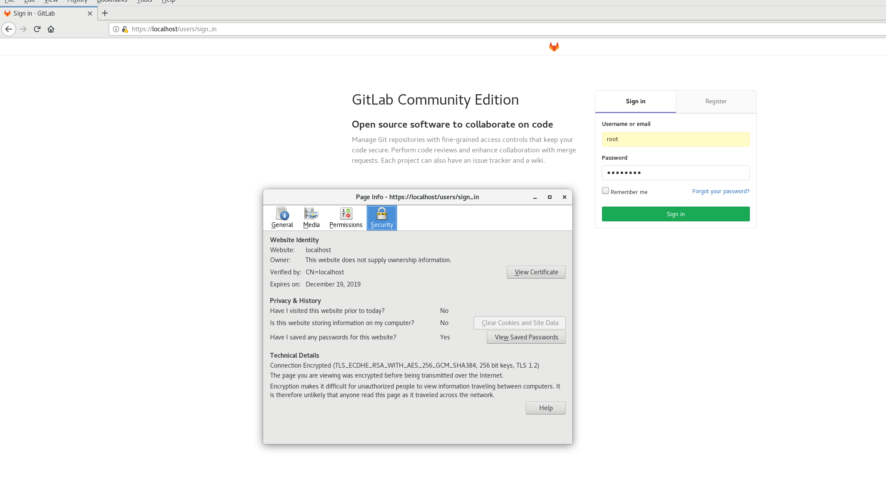

# Enable SSL Self Sign On secure communication.

## Description:
We will extend gitlab configuration by enabling ssl for WebGui.It may be very important to
have crypted communication between web browser and Gitlab server. Is very hard to imagine web services without SSL.

Using your favorite editor open file gitlab/conf/gitlab.rb and find directive:

```
# external_url 'GENERATED_EXTERNAL_URL'
```

Uncomment line 13 and change value to 'https://localhost'

```
external_url 'https://localhost'
```

This let know Gitlab to use external url with ssl enabled by default. But this is not enough to have ssl mode in Gitlab. 2nd step is expose docker port '443'. To have this you need to modify the docker-compose.yml file and add port definition:

Please edit docker-compose.yml file, find port exposition and add below entry:

`"0.0.0.0:443:443/tcp"`

File should looks as follow:

```
# Gitlab education - Gitlab Community Edition
# Persistent volume for gitlab data store.

version: '3.4'
services:

  cicd-gitlab:
    image: gitlab/gitlab-ce:latest
    volumes:
      - gitlab-log:/var/log/gitlab
      - gitlab-opt:/var/opt/gitlab
    secrets:
       - source: gitlab.rb
         target: /etc/gitlab/gitlab.rb
    hostname: cicd
    container_name: cicd
    restart: always
    networks:
       EDU_GITLAB_Net:
         ipv4_address: 101.101.101.2
    ports:
      - "0.0.0.0:80:80/tcp"
      - "0.0.0.0:443:443/tcp"
      - "0.0.0.0:4567:4567/tcp"

networks:
  EDU_GITLAB_Net:
    driver: bridge
    ipam:
      config:
        - subnet: 101.101.101.0/24

secrets:
  gitlab.rb:
    file: ./gitlab/conf/gitlab.rb

volumes:
  gitlab-log:
  gitlab-opt:
```

For better understanding docker-compose I would like to refer you to the documentation.

If we would like to see changes of course restart container is needed!

Type:

`docker-compose down`

Output:
```
Stopping cicd ... done
Removing cicd ... done
Removing network gitlab_EDU_GITLAB_Net
```

and then start it again:

`docker-compose up -d`

Output:
```
Creating network "gitlab_EDU_GITLAB_Net" with driver "bridge"
Creating cicd ... done
```

This time it can take a while because Gitlab need to be reconfigured and it will be done automatically!


`Be aware!`

Do not use -v flag when you type docker-compose down! If you will use this option your persistent volumes will be deleted forever!


From now Gitlab service is available on port 80 and 443. Please verify if your Gitlab server listening on port 443 also. Use Web browser to investigate if that is the case.

Voila, mine works fine :)



If any errors occur please read logs. It is first action which is required to determine what happen.
