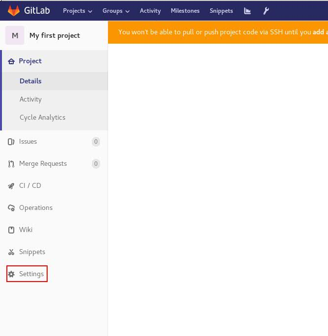
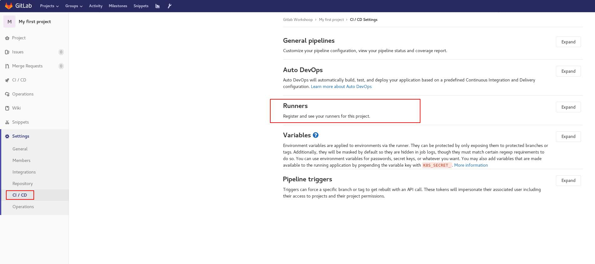
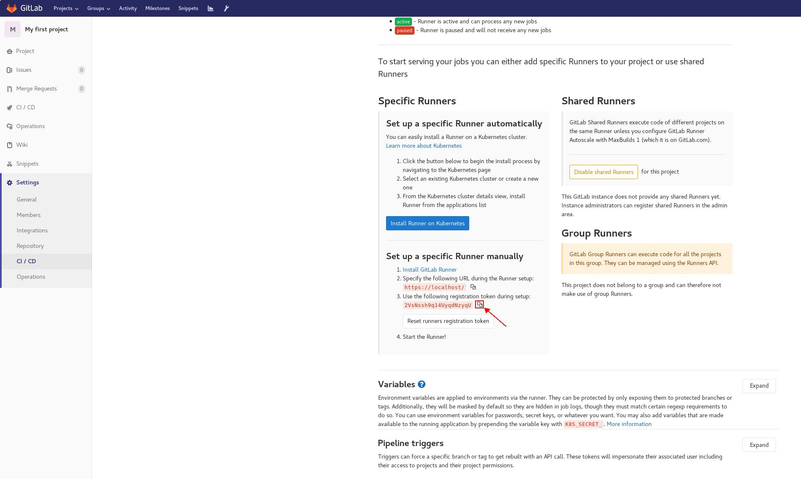
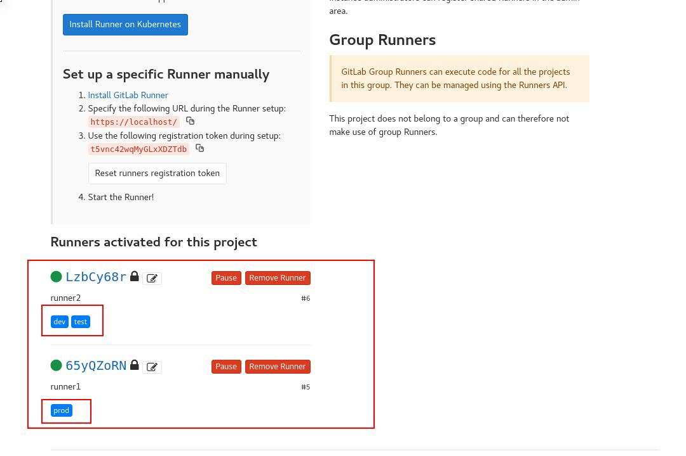
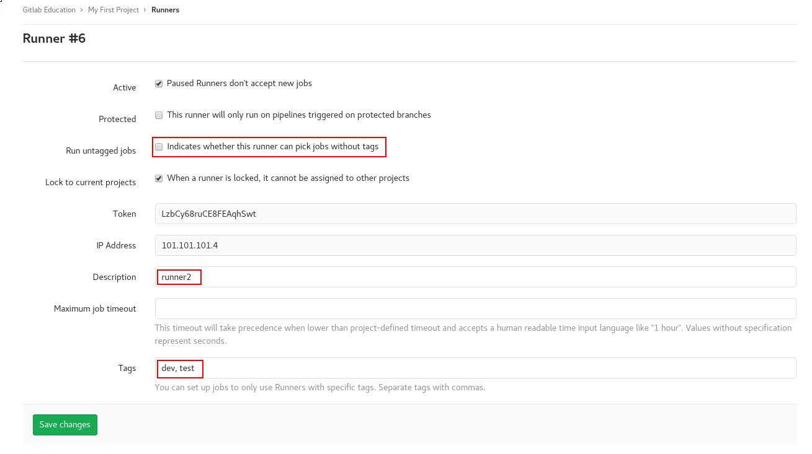

# Setup gitlab runner for feature project uses.

## Description
In this exercise we extend current docker compose configuration and we will adopt
gitlab-runner services. We will use them in further exercises ;-)

### Extend docker compose configuration
Remove comment for services: runner1 and runner2 (line from 30 to 59)
Remove comment for additional configuration for both runners (line 71, 72, 78, 79)

After change your docker-compose.yml should looks as below:

```
# Gitlab education - Gitlab Community Edition
# Persistent volume for gitlab data store.

version: '3.4'
services:

  cicd:
    image: gitlab/gitlab-ce:latest
    volumes:
      - gitlab-log:/var/log/gitlab
      - gitlab-opt:/var/opt/gitlab
      - gitlab-etc:/etc/gitlab
    secrets:
       - source: gitlab.rb
         target: /etc/gitlab/gitlab.rb
    hostname: cicd
    container_name: cicd
    restart: always
    networks:
       EDU_GITLAB_Net:
         ipv4_address: 101.101.101.2
    ports:
      - "0.0.0.0:80:80/tcp"
      - "0.0.0.0:443:443/tcp"
      - "0.0.0.0:4567:4567/tcp"
    extra_hosts:
      - "runner1:101.101.101.3"
      - "runner2:101.101.101.4"

  runner1:
    image: gitlab/gitlab-runner:latest
    secrets:
       - source: cicd.crt
         target: /etc/gitlab-runner/certs/cicd.crt
    hostname: runner1
    container_name: runner1
    restart: always
    networks:
       EDU_GITLAB_Net:
         ipv4_address: 101.101.101.3
    extra_hosts:
      - "cicd:101.101.101.2"
      - "runner2:101.101.101.4"

  runner2:
    image: gitlab/gitlab-runner:latest
    secrets:
       - source: cicd.crt
         target: /etc/gitlab-runner/certs/cicd.crt
    volumes: ["runner2-conf:/etc/gitlab-runner:Z", "/var/run/docker.sock:/var/run/docker.sock"]
    hostname: runner2
    container_name: runner2
    restart: always
    networks:
       EDU_GITLAB_Net:
         ipv4_address: 101.101.101.4
    extra_hosts:
      - "cicd:101.101.101.2"
      - "runner1:101.101.101.3"

networks:
  EDU_GITLAB_Net:
    driver: bridge
    ipam:
      config:
        - subnet: 101.101.101.0/24

secrets:
  gitlab.rb:
    file: ./gitlab/conf/gitlab.rb
  cicd.crt:
    file: ./gitlab-runner/conf/cicd.crt

volumes:
  gitlab-log:
  gitlab-opt:
  gitlab-etc:
  runner1-conf:
  runner2-conf:
```


`It would be good if you studied the entire configuration file and understood what it is used for and what it is responsible for.`

### Start 2 additional containers
You need to start 2 additional docker containers using docker-compose command. To do this
just run docker-compose up -d

`docker-compose up -d`

Output should be exactly the same:
```
cicd is up-to-date
Creating runner2 ... done
Creating runner1 ... done

```

Check if your docker services are up and running:

`docker-compose ps -a`

Output should looks similar:
```
[plp12439@oc2751557563 gitlab]$ docker ps -a
CONTAINER ID        IMAGE                         COMMAND                  CREATED             STATUS                   PORTS                                                                      NAMES
faa675603776        gitlab/gitlab-runner:latest   "/usr/bin/dumb-init …"   13 minutes ago      Up 13 minutes                                                                                       runner1
997961a8a8fd        gitlab/gitlab-runner:latest   "/usr/bin/dumb-init …"   13 minutes ago      Up 13 minutes                                                                                       runner2
8bd332be8952        gitlab/gitlab-ce:latest       "/assets/wrapper"        13 minutes ago      Up 8 minutes (healthy)   0.0.0.0:80->80/tcp, 0.0.0.0:443->443/tcp, 22/tcp, 0.0.0.0:4567->4567/tcp   cicd
```

Be aware!
Old services will stay untouchable. Only new ones will be implemented! If you are modified
old services also will be touch. Remember about it!

### Register gitlab-runners in Gitlab
This is very important task. Gitlab runners will be created and assign to particular project. We will use two types of
gitlab runners executor namely shell and docker. The second one is very interesting because from our point of view it
will be docker container inside docker :) I hope that you know dind shortcut.

As our lab system is well prepared we can just register runners. Below you can find 2 commands which will be executed
inside docker containers (runner1, runner2). So we will register runners docker itself.

Before you start you need to know your uniq token value. Here is step by step how to get this information, please go as follow:

→ Select your project next click Settings:


→ Click CI/CD


→ Next just copy register token ID:


Now time for register your Gitlab runners.

from your station shell execute below commands:

`for runner1 - shell`

```
TOKEN=<YOUR TOKEN>
docker exec -it runner1 gitlab-runner register -n --url https://cicd --registration-token $TOKEN --executor shell --description "runner1" --tls-ca-file /etc/gitlab-runner/certs/cicd.crt --tag-list prod --run-untagged=false
```

Output:
```
Runtime platform                                    arch=amd64 os=linux pid=115 revision=577f813d version=12.5.0
Running in system-mode.                            

Registering runner... succeeded                     runner=t5vnc42w
Runner registered successfully. Feel free to start it, but if it's running already the config should be automatically reloaded!
```

*Short explanation:*

**--url**: is just gitlab server (we have ssl enabled)

**--registration-token**: you must copy your own because is uniq for each project and each installation.

**--executor**: this indicate engine which will be used for execute commands.

**--description**: this value indicate gitlab runner name which will be visible in Gitlab Gui. Please remember about good naming convention!

**--tls-ca-file**: this is important when ssl has been enabled. You should specify gitlab server certificate path.

**--run-untagged**: when you will set this value to false gitlab runner will never execute jobs without proper markers.

**--tag-list**: define tags which will be used for marking gitlab runner.


Now from your station console type:


`for runner2 - dind`

```
docker exec -it runner2 gitlab-runner register -n --url https://cicd --registration-token $TOKEN --executor docker --description "runner2"  --docker-image docker:latest --docker-network-mode gitlab_EDU_GITLAB_Net  --docker-volumes "/var/run/docker.sock:/var/run/docker.sock" --tls-ca-file /etc/gitlab-runner/certs/cicd.crt --tag-list test,dev --run-untagged=false
```

Output:
```
Runtime platform                                    arch=amd64 os=linux pid=117 revision=577f813d version=12.5.0
Running in system-mode.                            

Registering runner... succeeded                     runner=t5vnc42w
Runner registered successfully. Feel free to start it, but if it's running already the config should be automatically reloaded!
```

When commands results will finish without errors your gitlab runners should be visible in gui:




After click runners detail you will ses something like this:



Please stop for a moment and try to study each of the fields. This let you know better understand what has happen in previous step.

Do you have any question? Please I'm open for it:)
